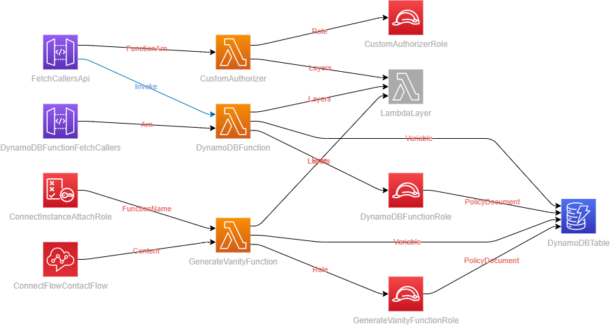
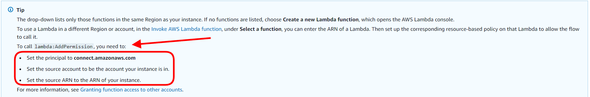
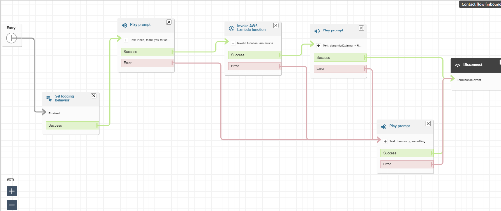
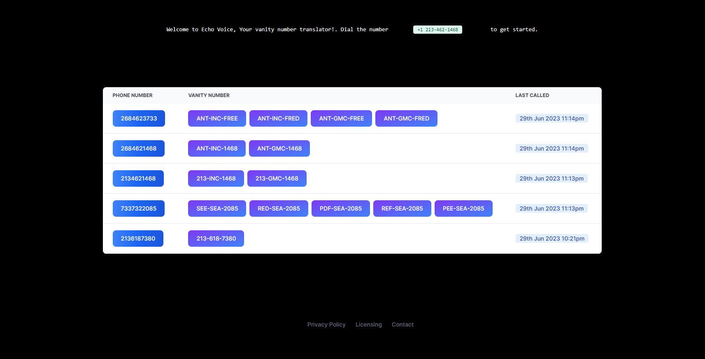

# Echo-Voice

This repository contains source code and supporting files for a serverless application that allows you to generate vanity numbers and use them to call your contacts. It includes the following files and folders.

```
📦echo-voice
┣ 📂backend
┃ ┣ 📂CustomAuthorizer
┃ ┃ ┣ 📜index.py
┃ ┃ ┗ 📜__init__.py
┃ ┣ 📂DynamoDBFunction
┃ ┃ ┣ 📜index.py
┃ ┃ ┗ 📜__init__.py
┃ ┣ 📂GenerateVanityFunction
┃ ┃ ┣ 📂helper
┃ ┃ ┃ ┣ 📜english.txt
┃ ┃ ┃ ┗ 📜generate_dic.py
┃ ┃ ┣ 📜index.py
┃ ┃ ┣ 📜words_dictionary3.json
┃ ┃ ┣ 📜words_dictionary4.json
┃ ┃ ┗ 📜__init__.py
┣ 📂frontend
┃ ┣ 📂public
┃ ┃ ┣ 📜next.svg
┃ ┃ ┗ 📜vercel.svg
┃ ┣ 📂src
┃ ┃ ┗ 📂app
┃ ┃ ┃ ┣ 📂components
┃ ┃ ┃ ┃ ┗ 📜main.js
┃ ┃ ┃ ┣ 📜favicon.ico
┃ ┃ ┃ ┣ 📜globals.css
┃ ┃ ┃ ┣ 📜layout.js
┃ ┃ ┃ ┗ 📜page.js
┃ ┣ 📜.env.local
┃ ┣ 📜.gitignore
┃ ┣ 📜jsconfig.json
┃ ┣ 📜next.config.js
┃ ┣ 📜package-lock.json
┃ ┣ 📜package.json
┃ ┣ 📜postcss.config.js
┃ ┣ 📜README.md
┃ ┗ 📜tailwind.config.js
┣ 📜.gitignore
┣ 📜README.md
┣ 📜samconfig.toml
┣ 📜template.drawio
┣ 📜template.yaml
```

- Backend - Code for the application's Lambda function
- Frontend - Code for the application's frontend
- template.yaml - A template that defines the application's AWS resources
- README.md - This file
- samconfig.toml - SAM CLI configuration file

The application uses several AWS resources, including Lambda functions and an API Gateway API. These resources are defined in the `template.yaml` file in this project. You can update the template to add AWS resources through the same deployment process that updates your application code.

## Vanity Number Generator


### How it works

- Detailed explanation of this project can be found [here](img/DETAILS.md).

- The vanity number is generated using a Lambda function that generates a vanity number from a given phone number. It uses a dictionary of words and their corresponding numbers to generate the vanity number.
- The function is invoked when a caller calls the Connect Flow. The Connect Flow invokes the function and passes the caller's phone number as a parameter.
- The function then generates a vanity number and returns it to the Connect Flow. The Connect Flow then uses the response to speak the vanity number to the caller. Example: If the caller's phone number is `2684623733`, the vanity number generated is `ANT-INC-FREE, ANT-INC-FRED, ANT-GMC-FREE`.
- If function also stores the vanity number in a DynamoDB table. The table is used to store the caller's phone number and the vanity number generated for the caller.
- The table is used to fetch the vanity number when the caller calls again.

```
Caller Phone Number | Vanity Number
-----------------------------------
2684623733          | ANT-INC-FREE, ANT-INC-FRED, ANT-GMC-FREE
```

## Requirements

- AWS CLI already configured with Administrator permission
- AWS SAM CLI already installed
- [Python 3 installed](https://www.python.org/downloads/)

## AWS Resources



The YAML template defines the following AWS resources:

- Lambda Function: `DynamoDBFunction, GenerateVanityFunction, CustomAuthorizer`
- DynamoDB: `DynamoDBTable`
- API Gateway: `FetchCallersApi`
- IAM: `GenerateVanityFunctionRole, DynamoDBFunctionRole, ConnectInstanceAttachRole, CustomAuthorizerRole`
  
- Connect: `ConnectFlowContactFlow`



## Deploy the application

To build and deploy your application for the first time, run the following in your shell:

```bash
Clone the repository
git clone https://github.com/mfiros/echo-voice.git
cd echo-voice
sam build
sam deploy --guided
```

The first command will build the source of your application. The second command will package and deploy your application to AWS, with a series of prompts:

```bash
Configuring SAM deploy
======================

    Looking for config file [samconfig.toml] :  Found
    Reading default arguments  :  Success

    Setting default arguments for 'sam deploy'
    =========================================
    Stack Name [sam-app]: echo-voice
    AWS Region [us-east-1]: us-east-1
    Parameter ConnectInstance [arn:aws:connect:us-east-1:1234565:instance/dce2318b-1234-1234-1234-123456789012]: arn:aws:connect:us-east-1:1234565:instance/dce2318b-1234-1234-1234-123456789012

    #Shows you resources changes to be deployed and require a 'Y' to initiate deploy
    Confirm changes before deploy [y/N]: y
    #SAM needs permission to be able to create roles to connect to the resources in your template
    Allow SAM CLI IAM role creation [Y/n]: Y
    Save arguments to configuration file [Y/n]: Y
    SAM configuration file [samconfig.toml]: samconfig.toml
    SAM configuration environment [default]: default

    Looking for resources needed for deployment: Found!


    Deploying with following values
    ===============================
    Stack name                   : echo-voice
    Region                       : us-east-1
    Confirm changeset            : True
    Deployment s3 bucket         : aws-sam-cli-managed-default-samclisourcebucket-1j2j2j2j2j2j
    Capabilities                 : ["CAPABILITY_NAMED_IAM"]
    Parameter overrides          : {"ConnectInstance": "arn:aws:connect:us-east-1:1234556:instance/dce2318b-1234-1234-1234-123456789012"}
    Signing Profiles             : {}

Initiating deployment
=====================
CloudFormation stack changeset
---------------------------------------------------------------------------------------------------------------------
Operation                     LogicalResourceId             ResourceType                  Replacement
---------------------------------------------------------------------------------------------------------------------
AWS::Lambda::Permission       N/A
+ Add                         DynamoDBFunctionFetchCaller   AWS::Lambda::Permission       N/A
                              sPermissionProd
+ Add                         DynamoDBFunctionRole          AWS::IAM::Role                N/A
+ Add                         DynamoDBFunction              AWS::Lambda::Function         N/A
+ Add                         DynamoDBTable                 AWS::DynamoDB::Table          N/A
+ Add                         FetchCallersApiDeployment71   AWS::ApiGateway::Deployment   N/A
                              09639b61
+ Add                         FetchCallersApiProdStage      AWS::ApiGateway::Stage        N/A
+ Add                         FetchCallersApi               AWS::ApiGateway::RestApi      N/A
+ Add                         GenerateVanityFunctionRole    AWS::IAM::Role                N/A
+ Add                         GenerateVanityFunction        AWS::Lambda::Function         N/A
---------------------------------------------------------------------------------------------------------------------

Previewing CloudFormation changeset before deployment
======================================================
Deploy this changeset? [y/N]: y

2023-06-29 13:33:44 - Waiting for stack create/update to complete

CloudFormation events from stack operations (refresh every 5.0 seconds)
---------------------------------------------------------------------------------------------------------------------
ResourceStatus                ResourceType                  LogicalResourceId             ResourceStatusReason
---------------------------------------------------------------------------------------------------------------------
CREATE_IN_PROGRESS            AWS::DynamoDB::Table          DynamoDBTable                 -             -
CREATE_IN_PROGRESS            AWS::DynamoDB::Table          DynamoDBTable                 Resource creation Initiated


```

The ouput of the deployment should look like this:

```bash
CloudFormation outputs from deployed stack
---------------------------------------------------------------------------------------------------------------------
Outputs
---------------------------------------------------------------------------------------------------------------------
Key                 FetchCallersApi
Description         API Gateway endpoint URL for Prod stage for FetchCallersApi function
Value               https://1234567890.execute-api.us-east-1.amazonaws.com/Prod/fetch


Successfully created/updated stack - echo-voice in us-east-1
```

## Frontend

The frontend is a simple Nextjs app that uses the API Gateway endpoint to call the Lambda function. The frontend is located in the `frontend` folder. To run the frontend locally, run the following commands:

```bash
cd frontend
npm install
npm run dev
```

### Environment Variables

The frontend requires the following environment variables to be set:

- `API_FETCH_URL`: The API Gateway endpoint URL for Prod stage for FetchCallersApi function
- `NEXT_PUBLIC_API_KEY`: The API key for the API Gateway endpoint

## Test the sample application

You can use the the number `+1 213-462-1468` to test the application. This number is an AWS Connect test number that will play a message and then hang up.
The message will result in a caller being added to the DynamoDB table. Possible vanity numbers will be generated and returned to the caller.

Frontend is available at https://echo-voice.vercel.app/ for demo
displays last 5 callers and their vanity numbers.


## Cleanup

To delete the application that you created, use the AWS CLI. Assuming you used your project name for the stack name, you can run the following:

```bash
sam delete --stack-name "echo-voice"
```

## Resources

- [AWS SAM](https://aws.amazon.com/serverless/sam/)
- [AWS Connect](https://aws.amazon.com/connect/)
- [Invoke AWS Lambda functions from Amazon Connect flows](https://docs.aws.amazon.com/connect/latest/adminguide/connect-lambda-functions.html)
- [AWS DynamoDB](https://aws.amazon.com/dynamodb/)
- [AWS API Gateway](https://aws.amazon.com/api-gateway/)
- [AWS Lambda](https://aws.amazon.com/lambda/)
- [AWS IAM](https://aws.amazon.com/iam/)
- [AWS CloudFormation](https://aws.amazon.com/cloudformation/)
- [AWS CloudWatch](https://aws.amazon.com/cloudwatch/)
